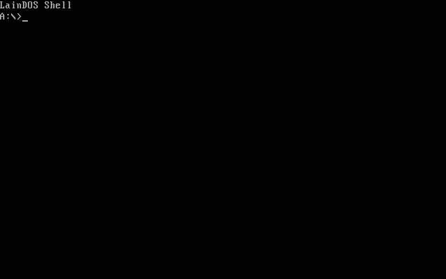

# LainDOS

A tiny single-tasking DOS, written from scratch in real-mode x86 NASM assembly, whose mission in life is booting period games.



That is LainDOS in QEMU: boot the floppy to the shell, `DIR` the disk, type `midemo`, and the bundled Monkey Island demo (VGA, 1990) plays.

## What it is

LainDOS implements the DOS that era software actually calls: the `INT 21h` file/memory/process APIs, MZ `.EXE` loading with relocation, MCB memory management, a small shell with batch files, writable FAT12/FAT16, read-only ISO-9660 CD-ROM with MSCDEX detection and CD audio device requests, a PS/2-backed `INT 33h` mouse driver, and an XMS shim — with the kernel itself resident in the High Memory Area, like late-era MS-DOS. It is not a FreeDOS replacement; it is a compatibility testbed that grows exactly as fast as its games demand, with faithful DOS semantics preferred over per-title hacks.

Games it runs today: **The Secret of Monkey Island** (demo bundled, full VGA version supported), **Monkey Island 2: LeChuck's Revenge** with working in-game save and load, **Sam & Max Hit the Road** from CD-ROM, **Simon the Sorcerer**, **Sid Meier's Civilization**, **Wolfenstein 3D**, **Ascendancy**, **Stunt Island**, **Wing Commander**, **The Settlers II Gold Edition**, **Micro Machines 2**, **Shortline**, and Norton Commander 5.5 for good measure.

Every change is gated by an automated QEMU regression ladder that currently passes `154/154` tests.

## Try it

- Download `laindos-monkey-demo-nightly.zip` from the [nightly release](https://github.com/lambadalambda/laindos/releases/tag/nightly) — a bootable Monkey Island demo floppy image for any PC emulator.
- Download `laindos-installer-nightly.zip` from the same release for a bootable installer/updater floppy. Boot from the floppy, attach a raw hard-disk image as the first IDE disk, then run `INSTALL` from `A:\>` to format a blank disk or update an existing LainDOS FAT16 install in place.
- Or read the [interactive documentation site](https://lambadalambda.github.io/laindos/), annotated source walkthroughs with the same floppy bootable in-page via an embedded v86 emulator.
- Or build and run it yourself (needs NASM, Python 3, and QEMU):

```sh
make monkey-demo
make run-monkey-demo
```

## Documentation

- [Current status & compatibility](docs/status.md) — what works, scope, compatibility notes.
- [Architecture](docs/architecture.md) — memory layout, CPU target, toolchain, source layout, project tracking.
- [Building & testing](docs/building.md) — build/test workflows, mise tasks, QEMU selection, the docs site.
- [Game images](docs/games.md) — building, running, and smoke-testing each game target.
- [Test ladder](docs/test_ladder.md) — how to write and register a regression test.
- [Emulator workflows](docs/emulator_workflows.md) — QEMU/86Box/Bochs debugging setups.
- `docs/debug_log.md` — the running investigation log.

## License

LainDOS is released under the CC0 1.0 Universal public domain dedication. See `LICENSE`.
